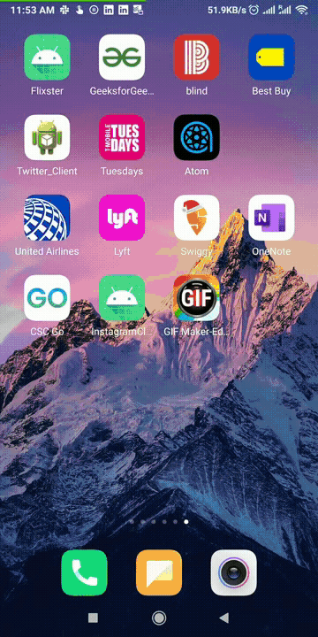

# *Instagram Clone*

**InstagramClone** is a photo sharing app similar to Instagram but using Parse as its backend.

Time spent: **8** hours spent in total

## User Stories

The following **required** functionality is completed:

- [X] User can sign up to create a new account using Parse authentication.
- [X] User can log in and log out of his or her account.
- [X] The current signed in user is persisted across app restarts.
- [X] User can take a photo, add a caption, and post it to "Instagram".

The following *additional** features are implemented:

- [ ] User sees app icon in home screen and styled bottom navigation view
- [ ] Style the feed to look like the real Instagram feed.
- [ ] After the user submits a new post, show an indeterminate progress bar while the post is being uploaded to Parse.

## Video Walkthrough

Here's a walkthrough of implemented user stories:



GIF created with [GIF Maker, GIF Editor](https://play.google.com/store/apps/details?id=com.media.zatashima.studio&hl=en_US&gl=US).

## Getting Started

### Clone the Repository

Get started by cloning the project to your local machine:

```
$ https://github.com/Rohit-Badugu/InstagramClone.git
```

## Prerequisites
1. Async HTTP client ```https://github.com/codepath/android_guides/wiki/Using-CodePath-Async-Http-Client```
2. Glide for loading images ```https://github.com/bumptech/glide```


## Android Version Targeting
Application is currently built to work with Android API 23(Marshmallow). 


## License

    Copyright [yyyy] [name of copyright owner]

    Licensed under the Apache License, Version 2.0 (the "License");
    you may not use this file except in compliance with the License.
    You may obtain a copy of the License at

        http://www.apache.org/licenses/LICENSE-2.0

    Unless required by applicable law or agreed to in writing, software
    distributed under the License is distributed on an "AS IS" BASIS,
    WITHOUT WARRANTIES OR CONDITIONS OF ANY KIND, either express or implied.
    See the License for the specific language governing permissions and
    limitations under the License.

