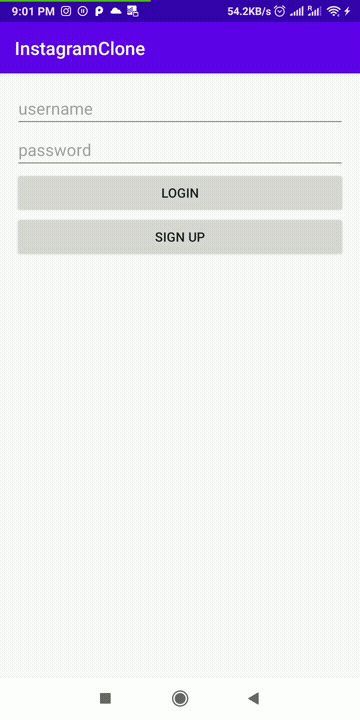

# *Instagram Clone*

**InstagramClone** is a photo sharing app similar to Instagram but using Parse as its backend.

Time spent: **10** hours spent in total

## User Stories

The following **required** functionality is completed:

- [X] User can view last 20 posts submitted to Instagram.
- [X] User is able to switch between different tabs - view all posts, compose tab and profile tab.
- [X] User can pull to refresh last 20 posts.


## Video Walkthrough

Here's a walkthrough of implemented user stories:



GIF created with [GIF Maker, GIF Editor](https://play.google.com/store/apps/details?id=com.media.zatashima.studio&hl=en_US&gl=US).

## Getting Started

### Clone the Repository

Get started by cloning the project to your local machine:

```
$ https://github.com/Rohit-Badugu/InstagramClone.git
```

## Prerequisites
1. Async HTTP client ```https://github.com/codepath/android_guides/wiki/Using-CodePath-Async-Http-Client```
2. Glide for loading images ```https://github.com/bumptech/glide```


## Android Version Targeting
Application is currently built to work with Android API 23(Marshmallow). 


## License

    Copyright [yyyy] [name of copyright owner]

    Licensed under the Apache License, Version 2.0 (the "License");
    you may not use this file except in compliance with the License.
    You may obtain a copy of the License at

        http://www.apache.org/licenses/LICENSE-2.0

    Unless required by applicable law or agreed to in writing, software
    distributed under the License is distributed on an "AS IS" BASIS,
    WITHOUT WARRANTIES OR CONDITIONS OF ANY KIND, either express or implied.
    See the License for the specific language governing permissions and
    limitations under the License.

